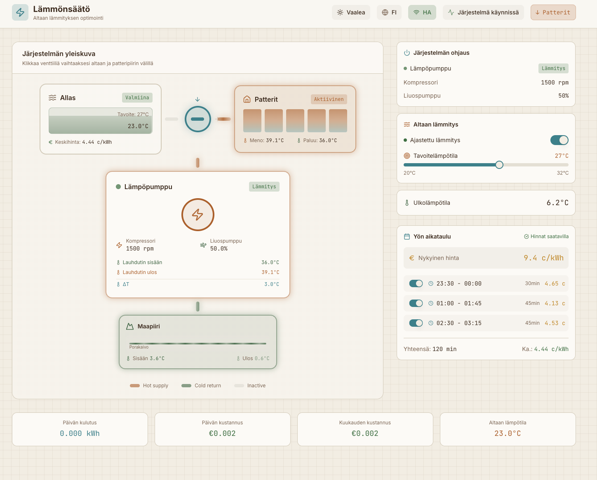
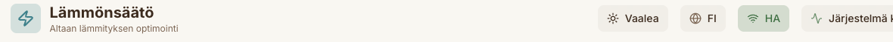
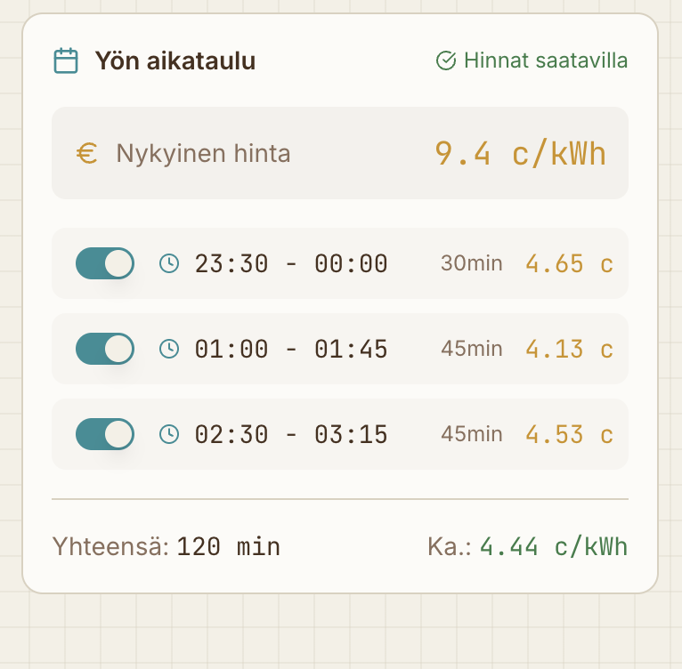
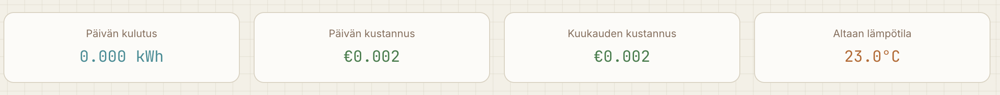

# Lämmönsäätö – Käyttöohje

Altaan lämmityksen optimointijärjestelmä

---

## Yleiskatsaus

Lämmönsäätö on käyttöliittymä, joka näyttää maalämpöpumpun ja allaslämmityksen tilaa reaaliaikaisesti. Järjestelmä optimoi altaan lämmityksen yösähkön halvimpiin tunteihin Nordpool-hintojen perusteella. Kun altaan lämpötila saavuttaa ylärajan, lämmitys pysähtyy automaattisesti – näin vältetään turha energiankulutus.

---

## Energialaskenta

Järjestelmä laskee altaaseen siirretyn lämpöenergian ja sitä vastaavan sähkönkulutuksen.

### Lämpöenergian laskenta

Altaaseen siirretty lämpöenergia lasketaan lämpöpumpun lauhduttimen lämpötilaerosta:

1. Mitataan lauhduttimeen menevän ja sieltä tulevan veden lämpötilaero (ΔT)
2. Kerrotaan virtausnopeudella (45 litraa minuutissa)
3. Kerrotaan veden ominaislämpökapasiteetilla (4,186 kJ/kg·K)

Tulos on altaaseen siirretty lämpöteho kilowatteina.

### Sähkönkulutuksen laskenta

Lämpöpumppu tuottaa lämpöä tehokkaammin kuin suora sähkölämmitys. Thermia Mega -maalämpöpumpun hyötysuhde (COP) on tyypillisesti 3–4.

Järjestelmä käyttää varovaista arviota COP 3,0:
- Jos altaaseen siirtyy 3 kWh lämpöä, sähköä kuluu noin 1 kWh
- Todellinen kulutus voi olla pienempi olosuhteista riippuen

### Kustannuslaskenta

Sähkönkulutus kerrotaan kunkin vartin spot-hinnalla. Näin saadaan tarkka kustannus toteutuneella kulutuksella ja oikeilla hinnoilla.

---

## Käyttöliittymän osat

### Yläpalkki

Yläpalkissa näkyvät:

| Elementti | Toiminto |
|-----------|----------|
| **Vaalea/Tumma** | Vaihtaa väriteman vaaleaan tai tummaan tilaan |
| **FI** | Kielivalinta (suomi/englanti) |
| **HA** | Home Assistant -yhteyden tila (vihreä = yhdistetty) |
| **Järjestelmä käynnissä** | Lämpöpumpun toimintatila |
| **Patterit/Allas** | Näyttää aktiivisen lämmityspiirin |

---

## Järjestelmän yleiskuva

Keskellä oleva kaavio näyttää lämmitysjärjestelmän komponentit ja niiden väliset yhteydet.

### Allas

Allasosio näyttää:
- **Tila**: Valmiina, Lämmitys käynnissä tai Pois päältä
- **Lämpötilan yläraja**: Asetettu yläraja (esim. 26°C)
- **Nykyinen lämpötila**: Paluulinjan mitattu lämpötila
- **Keskihinta**: Lämmitykseen käytetyn / käytettävän sähkön keskihinta tänään.

### Patterit

Patteriosio näyttää kiertovesilämmityksen tilan:
- **Tila**: Aktiivinen tai Valmiustilassa
- **Meno**: Lämpöpumpulta lähtevän veden lämpötila
- **Paluu**: Pattereista palaavan veden lämpötila

### Venttiili

Venttiilikuvake osoittaa, kumpaan piiriin lämpö ohjataan:
- **Venttiili pystysuoraan**: Lämpö ohjautuu pattereihin
- **Venttiili vaakaan**: Lämpö ohjautuu altaaseen

Venttiiliä voi ohjata klikkaamalla kuvaketta.

### Lämpöpumppu

Lämpöpumppu-osio näyttää:
- **Toimintatila**: Lämmitys, Jäähdytys tai Pois
- **Kompressorin kierrosnopeus**: RPM-lukema (pulssi reagoi nopeuteen)
- **Liuospumppu**: Maapiirin pumpun teho prosentteina
- **Lauhdutin sisään/ulos**: Vesipiirin lämpötilat
- **ΔT**: Lämpötilaero sisään- ja ulostulon välillä

### Maapiiri

Maapiiri-osio näyttää porakaivon tiedot:
- **Sisään**: Maasta palaavan liuoksen lämpötila
- **Ulos**: Maahan menevän liuoksen lämpötila

---

## Järjestelmän ohjaus

Oikeanpuoleinen paneeli sisältää säädöt.

### Lämpöpumppu

Näyttää lämpöpumpun tilan ja perustiedot:
- Toimintatila (Lämmitys/Jäähdytys/Pois)
- Kompressorin kierrosnopeus
- Liuospumpun teho

### Altaan lämmitys

- **Ajastettu lämmitys**: Kytkin aktivoi tai poistaa käytöstä yöaikataulun mukaisen lämmityksen
- **Lämpötilan yläraja**: Liukusäädin asettaa altaan lämpötilan ylärajan (20–32°C)

Kun altaan lämpötila ylittää ylärajan, järjestelmä ohittaa jäljellä olevat lämmityslohkot. Lämmitys jatkuu seuraavana yönä vain, jos lämpötila on laskenut alle ylärajan.

### Ulkolämpötila

Näyttää ulkoilman lämpötilan.

---

## Yön aikataulu

Aikataulu näyttää tulevan yön lämmityslohkot.

### Tilan ilmaisimet

| Merkintä | Selitys |
|----------|---------|
| **Hinnat saatavilla** | Nordpool-hinnat on haettu onnistuneesti |
| **Odotetaan hintoja** | Seuraavan päivän hintoja ei ole vielä julkaistu |

### Nykyinen hinta

Näyttää tämänhetkisen sähkön spot-hinnan (c/kWh).

### Lämmityslohkot

Jokainen lohko näyttää:
- **Kytkin**: Aktivoi tai poistaa lohkon käytöstä
- **Aikaväli**: Milloin lämmitys tapahtuu (esim. 23:30–00:00)
- **Kesto**: Lohkon pituus minuutteina
- **Hinta**: Kyseisen tunnin sähkön hinta

Lohkot järjestetään halvimmasta kalleimpaan. Järjestelmä valitsee automaattisesti edullisimmat tunnit ylärajan saavuttamiseksi.

### Lohkon poistaminen käytöstä

Yksittäisen lohkon voi poistaa käytöstä kytkimellä. Poistettu lohko näkyy:
- Vaaleanpunaisella taustalla
- Yliviivatulla tekstillä

Tämä on hyödyllistä, jos tiedetään, että lämmitystä ei tarvita tiettynä aikana.

### Yhteenveto

Aikataulun alla näkyvät:
- **Yhteensä**: Suunniteltu lämmitysaika minuutteina
- **Ka.**: Lämmitykseen käytetyn sähkön keskihinta

---

## Tilastot

Sivun alareunassa näkyvät:

| Mittari | Selitys |
|---------|---------|
| **Päivän kulutus** | Altaan lämmitykseen kulunut energia (kWh) |
| **Päivän kustannus** | Energiakustannus euroina |
| **Kuukauden kustannus** | Kumulatiivinen kuukausikustannus |
| **Altaan lämpötila** | Nykyinen mitattu lämpötila |

---

## Väriteemat

Käyttöliittymässä on kaksi väriteemaa:

### Tumma teema
Teollinen, tumma ulkoasu, joka sopii hämärään ympäristöön ja vähentää silmien rasitusta.

### Vaalea teema
70-luvun arkkitehtuurista inspiroitunut lämmin värimaailma. Värit on poimittu Lauttasaaren 70-luvun rakennuksista:
- Lämpimät kerma- ja okrasävyt
- Ruskeat aksentit
- Männynvihreä kylmille piireille

Teeman vaihtaminen: klikkaa yläpalkin **Vaalea**/**Tumma**-painiketta.

---

## Toimintaperiaate

1. **Hintojen haku**: Järjestelmä hakee Nordpool-hinnat päivittäin klo 14 jälkeen
2. **Aikataulun luonti**: Algoritmi valitsee halvimmat tunnit yölle (klo 23–07)
3. **Lämmityksen ohjaus**: Ajastetuilla tunneilla venttiili ohjataan altaaseen ja lämmitys aktivoidaan
4. **Ylärajan seuranta**: Kun lämpötilan yläraja saavutetaan, loput lohkot ohitetaan
5. **Palautus**: Lämmitysjakson jälkeen venttiili palaa patteripiiriin

---

## Vianmääritys

| Ongelma | Mahdollinen syy | Toimenpide |
|---------|-----------------|------------|
| HA-yhteys punainen | Home Assistant ei vastaa | Tarkista HA:n tila ja verkko |
| Hinnat puuttuvat | Nordpool ei ole julkaissut hintoja | Odota klo 14 jälkeen |
| Lämmitys ei käynnisty | Ajastettu lämmitys pois päältä | Aktivoi kytkin ohjauspaneelista |
| Venttiili ei vaihdu | Venttiili siirtymätilassa | Odota siirtymän valmistumista |

---

---

*Versio 1.0 – Joulukuu 2025*
